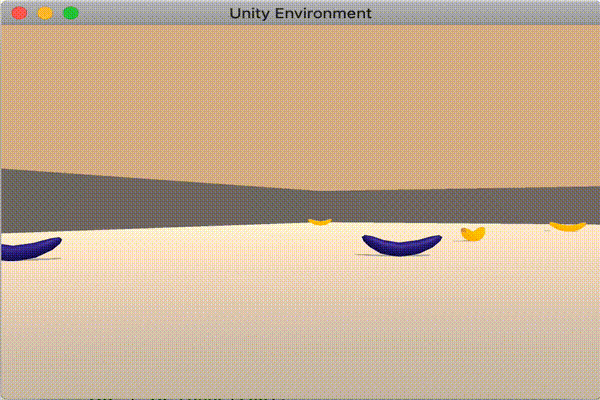

# Project 1: Navigation
## Udacity Deep Reinforcement Learning Nano-Degree
by Kitson Swann
submitted: 2021-02-21

This repository contains a solution to the first project of Udacity's Deep Reinforcement Learning Nano-degree. The instructions for the project are [here](https://github.com/udacity/deep-reinforcement-learning/tree/master/p1_navigation).

The goal of this project is to use the Deep Q-Learning algorithm to train an agent to solve the Unity Banana environment. The Unity Banana environment is a simple 3d environment consisting of a bounding box, and a number of blue and yellow bananas. A successful agent moves around collecting only the yellow bananas avoiding the blue ones.

For the purpose of this assignment, the task is considered solved when the agent can get an average score of +13 over 100 consecutive episodes.

## Banana Environment

### Actions

At any time, the agent can take one of four actions:
- `0` - walk forward 
- `1` - walk backward
- `2` - turn left
- `3` - turn right

### States

The state space has `37` dimensions and contains the agent's velocity, along with ray-based perception of objects around agent's forward direction.

### Rewards

A reward of `+1` is provided for collecting a yellow banana, and a reward of `-1` is provided for collecting a blue banana.

## Project Installation

This project requires:

- Unity
- Python 3.6

1. Clone this repository `https://github.com/kswann-mck/udacity_drl_p1.git`
2. [Install Unity](https://unity3d.com/get-unity/download)
3. Create a folder `env` inside the cloned repo, and download the zip file containing the environment [here](https://s3-us-west-1.amazonaws.com/udacity-drlnd/P1/Banana/Banana.app.zip) and put the `Banana.app` file in the `env` folder.
4. Create a conda environment with the requirements by doing the following `conda env create --name udacity_drl_p1 --file=environment.yml python=3.6`
5. Activate the environment: `conda activate udacity_drl_p1`
6. Run jupyter lab with `jupyterlab`
7. Open the [Report.ipynb](Report.ipynb) file in jupyter lab.

## Project Structure

- [model.py](model.py) - defines the structure of the q-network using PyTorch
- [dqn_agent.py](dqn_agent.py) - defines the agent implementation including the learning step
- [train.py](train.py) - defines the training loop to run a training sequence with a given set of hyperparameters
- [optimize.py](optimize.py) - defines an optimization routine to search for optimal hyperparameters
- [Report.ipynb](Report.ipynb) - defines the solution steps, algorithm and outputs from different training and optimiztion runs
- [checkpoint_base_model.pth](checkpoint_base_model.pth) - the saved model weights from the initial parameter choices 
- [checkpoint_optimal_model.pth](checkpoint_optimal_model.pth) - the saved model weights from the initial parameter choices
- [playing.gif](playing.gif) - a gif of the trained optimal agent playing
- [environment.yml](environment.yml) - the conda environment file for reproducing the experiment

## Instructions

After you have successfully installed units and set up the python 3.6 environment and the conda environment requirements. If you wish, you can re-run the experiment by re-running all the cells in the [Report.ipynb](Report.ipynb). Note that the hyperparameter search takes on the order of hours to run without a GPU so don't re-run that if you don't have time.

